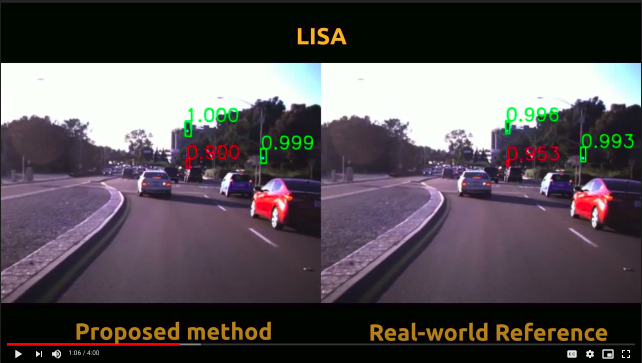

# Deep traffic light detection by overlaying synthetic context on arbitrary natural images
[Jean Pablo Vieira de Mello](https://github.com/Jpvmello), [Lucas Tabelini Torres](https://github.com/lucastabelini), [Rodrigo F. Berriel](http://rodrigoberriel.com/), [Thiago M. Paixão](https://sites.google.com/view/thiagopx), [Alberto F. De Souza](https://inf.ufes.br/~alberto), [Claudine Badue](https://www.inf.ufes.br/~claudine/), [Nicu Sebe](http://disi.unitn.it/~sebe/) and [Thiago Oliveira-Santos](https://www.inf.ufes.br/~todsantos/home)

Source code, trained models and image sets referring to the paper **Deep traffic light detection by overlaying synthetic context on arbitrary natural images**, published in [SIBGRAPI 2020](https://sibgrapi2020.cin.ufpe.br) C&G Track ([Elsevier Computer & Graphics Journal (CAG)](http://www.journals.elsevier.com/computers-and-graphics/) special issue) are available here.

DOI: [10.1016/j.cag.2020.09.012](https://doi.org/10.1016/j.cag.2020.09.012)
arXiv: [https://arxiv.org/pdf/2011.03841](https://arxiv.org/pdf/2011.03841)
Free ScienceDirect Share Link: (https://authors.elsevier.com/a/1c2eGMFvH~cEL)[https://authors.elsevier.com/a/1c2eGMFvH~cEL] (available until December 30, 2020)


### Abstract

Deep neural networks come as an effective solution to many problems associated with autonomous driving. By providing real image samples with traffic context to the network, the model learns to detect and classify elements of interest, such as pedestrians, traffic signs, and traffic lights. However, acquiring and annotating real data can be extremely costly in terms of time and effort. In this context, we propose a method to generate artificial traffic-related training data for deep traffic light detectors. This data is generated using basic non-realistic computer graphics to blend fake traffic scenes on top of arbitrary image backgrounds that are not related to the traffic domain. Thus, a large amount of training data can be generated without annotation efforts. Furthermore, it also tackles the intrinsic data imbalance problem in traffic light datasets, caused mainly by the low amount of samples of the yellow state. Experiments show that it is possible to achieve results comparable to those obtained with real training data from the problem domain, yielding an average mAP and an average F1-score which are each nearly 4 p.p. higher than the respective metrics obtained with a real-world reference model.

## Generating synthetic dataset

Use the script `generate_dataset.py` to generate a synthetic traffic light dataset, combining the following input arguments:

```
--bgs-path <path>           Path to the background images`
--traffic-path <path>       Path to the foreground images`
--labels-path <path>        Path to the directory containing the traffic lights labels files
--out-path <path>           Output dataset path
--total-images <num-images> Number of images to be generated
--resize                    Optional argument. If used, the output images will have double the original background images size.
```

Each foreground must have its own labels `.txt` file. Each row of the file corresponds to one bounding box, represented as following:

`class norm-x norm-y norm-width norm-height`,

where

```
class           Traffic light state: red, yellow or green
norm-x          Normalized horizontal center coordinate of the bounding box
norm-h          Normalized vertical center coordinate of the bounding box
norm-width      Normalized width of the bounding box
norm-height     Normalized height of the bounding box
```

## Trained models

The trained models described in the paper are available [here](https://drive.google.com/drive/folders/1QaEAnz3QVVn1jULjRXHPT6HKmem5NILq).

## Image sets

### Synthetic foregrounds

The synthetic foregrounds used to train the models and their respective annotations are available [here](https://drive.google.com/drive/folders/1pX9GUUyu_idc42iWstj9dSUXOhk7ziHl).

### Proprietary dataset

The proprietary dataset used to box-validate and test the models is available [here](https://drive.google.com/drive/folders/1iATG5suB9bHnFi9x6XaWtjG-uzwsJ8kb), along with the images' respective annotations. The annotations files describe one bounding box per row, following this pattern:

`path,x1,y1,x2,y2,class`,

where

```
path    Path to the image
x1      Top-left horizontal coordinate
y1      Top-left vertical coordinate
x2      Bottom-right horizontal coordinate
y2      Bottom-right vertical coordinate
```

## Qualitative results

[](https://drive.google.com/file/d/1UosUxayPyi1M8qn44FBcwrDOqMKw8Itu/view?usp=sharing)

## Generate your own foregrounds

***Note: the 3D car model used in this work was available in [here](https://free3d.com/3d-model/bmw-x5-1542.html), but the link seems not to be working anymore. Also, information about the model creator does not seem to be available. I'm not sure if the model can be freely shared without his/her consent and need to find a way to contact him/her about the access to this model. Meanwhile, you can use the synthetic dataset provided in section Synthetic foregrounds. If for some reason this link becomes available again, consider following what is described in this section in order to generate your own foregrounds.***

If you wish to generate your own foregrounds set, consider installing the [Processing](https://processing.org/) environment and running the file `generate_foregrounds.pde` (note that a `.pde` file must be contained within a directory with the same name without extension). Browse to the Processing installation path and run:

`./processing-java --sketch=<pde-path> --run <num-imgs> [<cxt-restric>] [<seed>]`, where

```
pde-path    Path to the .pde file
num-imgs    Number of output foreground images
cxt-restric Optional. If "context", only contextualized foregrounds will be generated. If "no-context", only uncontextualized foregrounds will be generated. If other string or not provided, paired contextualized and uncontextualized sets will be generated
seed        Optional. Initial random seed. Default: 1
```
***Note:*** in the current implementation, each scene is generated according to a different random seed, so that paired contextualized and uncontextualized scenes can be generated equivalenty and distinct from other pairs. The random seed is incremented by one, from its initial value, for each scene which is generated or discarded due to the abscence of elligible traffic lights. The final seed value will be exhibit in the end of the run and saved in a separated file. Be careful not to generate repeated scenes in different sets if not desired. The foreground images provided in section **Synthetic foregrounds** were generated using random seeds from 1 to 20,614 (train set) and from 30,000 to 37,211 (validation set). The code can be modified to use a single random seed and make equivalent drawing in two (with and without context) different rendering objects simultaneously.
